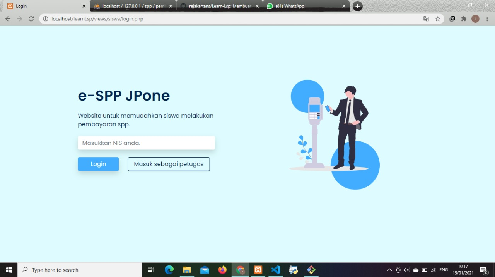
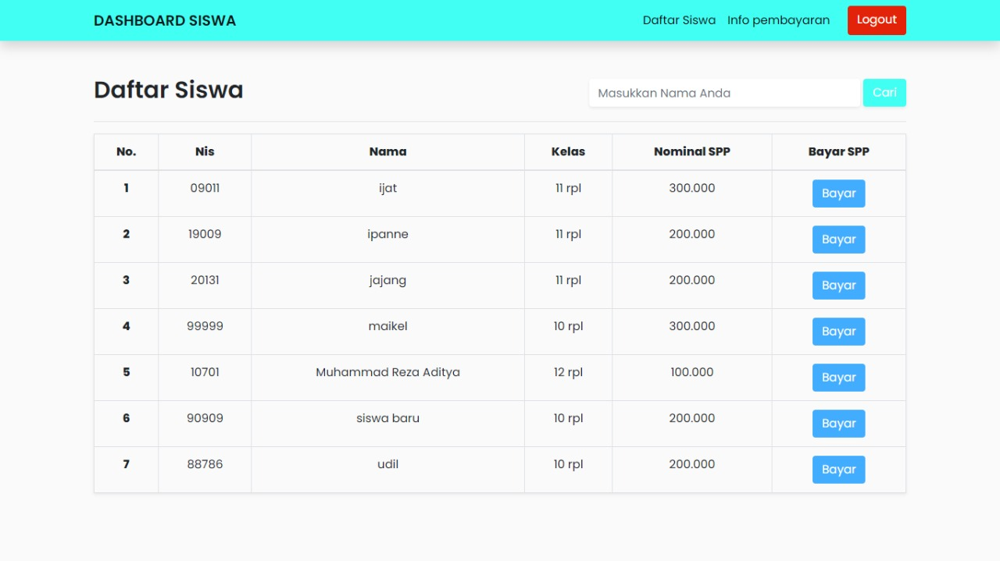

Create an online spp project to learn LSP assignments with PHP Native and Bootstrap

Clone Projcet
```sh
$ git clone https://github.com/rejakartans/Learn-Lsp.git
```

put the folder in xampp / htdocs


Running
```sh
Localhost/learnLsp/views/siswa/login.php
```


views Login




views Dashboard

